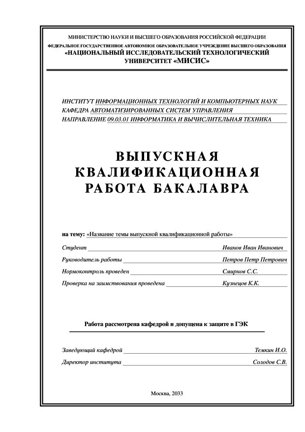
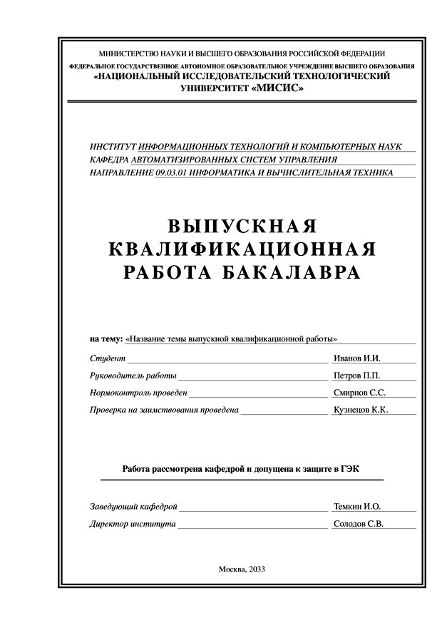

## Настройка шаблона

Параметры класса документа, указываются после команды `\documentclass`

1. *тип ВКР*
* `bachelor`  – бакалаврская диссертация
* `master`    – магистерская диссертация

2. *гиперссылки*
* `blackurls` – ссылки на литературу, таблицы, рисунки, формулы и т.п. не выделяются цветом (используется для ч/б печати)
* `colurls`   – цветные ссылки (для распространения пояснительной записки в электронном виде)

3. *оформление титульного листа*
* `titlestd`  – согласно методическим указаниям
* `titleikn`  – согласно рекомендациям кафедры АСУ

`titleikn`        | `titlestd`
:----------------:|:----------------:
 | 

<details open>
<summary>Ниже заполняется информация о ВКР</summary>

```latex
% ФИО студента
\AuthorShortName{}
\AuthorFullName{} % полностью
\AuthorFullNameGen{} % полностью в родительном падеже
% Номер группы
\AuthorGroup{}

% Тема работы
\ThesisTitle{}

% Научный руководитель
\SupervisorShort{}
\SupervisorFull{}
\SupervisorDegree{}

% Нормоконтроль
\GOSTComplianceReviewer{}
% Проверка на заимствования
\PlagiarismChecker{}

% Название кафедры, ФИО зав. кафедрой
\DeptShort{}
\DeptFull{}
\DeptHead{}

% Название института, ФИО директора
\InstShort{}
\InstFull{}
\InstHead{}

% Шифр специальности, краткое и полное наименование специальности
\SpecShort{}
\SpecFull{}

% Место и год выполнения работы
\City{}
\Year{}
```
</details>


<details open>
<summary>Далее следует информация о задании на ВКР</summary>

```latex
% Цель работы
\ThesisPurpose{}

% Исходные данные
\ThesisData{}
 
% Основная литература, в том числе:
% Монографии, учебники и т.п.
\ThesisBooks{}

% Отчеты по НИР, диссертации, дипломные работы и т.п.
\ThesisReports{}

% Периодическая литература (журналы)
\ThesisJournals{}

% Справочники и методическая литература (в том числе литература 
% по методам обработки экспериментальных данных)
\ThesisManuals{}

% Перечень основных этапов исследования и форма промежуточной 
% отчётности по каждому этапу
\ThesisStages{}

% Аппаратура и методики, которые должны быть использованы в работе
\ThesisEquipment{}

% Использование ЭВМ
\ThesisComputer{}

% Перечень (примерный) основных вопросов, которые должны быть 
% рассмотрены и проанализированы в литературном обзоре
\ThesisLitReview{}

% Перечень (примерный) графического и иллюстрированного материала
\IllustrMaterials{}

% Дата выдачи задания
\DateAssignment{}

% Дата утверждения задания (должна быть не раньше даты выдачи задания)
\DateApproval{}
```
</details>